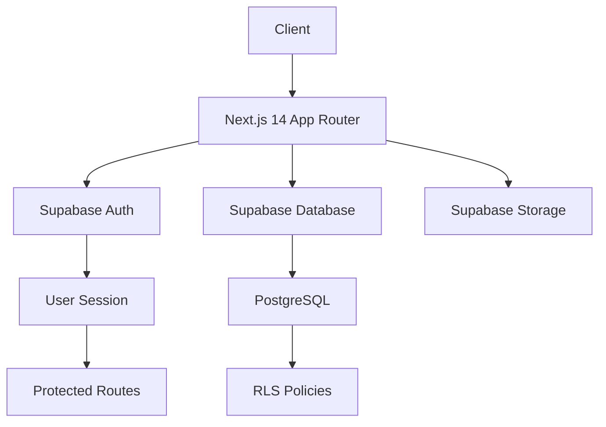
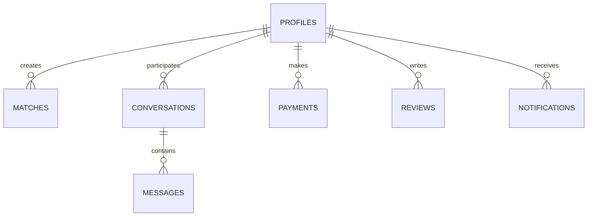

# 🚀 VeXachat - Advanced Social Dating Platform

<div align="center">


**Experience the future of social dating with AI-powered matching, immersive chat experiences, and unlimited possibilities.**

[Live Demo](https://vexachat.world) • [Documentation](#documentation) • [Report Bug](mailto:vexa@vexachat.world)

</div>

---

## ✨ Features

### 🎯 Core Features
- **🤖 AI-Powered Matching**: Advanced algorithms for intelligent compatibility matching
- **💬 Unlimited Messaging**: Free and premium chat with rich media support
- **🎥 Live Video Rooms**: Group and private video sessions
- **🔒 Privacy First**: End-to-end encryption and anonymous browsing
- **🌍 Global Reach**: Multi-language support with RTL/LTR
- **⭐ Expert Consultants**: Professional relationship advisors

### 🎨 Design Features
- **Cyberpunk Glassmorphism**: Heavy glass effects with neon accents
- **Advanced Animations**: Framer Motion powered interactions
- **3D Backgrounds**: Three.js powered immersive experiences
- **Responsive Design**: Mobile-first approach
- **Dark Mode**: Built-in with neon aesthetics

### 🔐 Security Features
- **Supabase Authentication**: Secure email/password authentication
- **Row Level Security**: Database-level access control
- **Protected Routes**: Middleware-based route protection
- **Session Management**: Secure cookie-based sessions

---

## 🏗️ Architecture



### Tech Stack

- **Frontend**: Next.js 14 (App Router), React 18
- **Authentication**: Supabase Auth with SSR
- **Database**: PostgreSQL (Supabase)
- **Styling**: CSS3, Custom Animations
- **3D Graphics**: Three.js, React Three Fiber
- **Animations**: Framer Motion
- **Deployment**: Vercel (recommended)

---

## 🚀 Quick Start

### Prerequisites

```bash
Node.js >= 18.0.0
npm >= 9.0.0
Supabase Account
```

### Installation

1. **Clone the repository**
```bash
git clone https://github.com/yourusername/vexachat.git
cd vexachat
```

2. **Install dependencies**
```bash
npm install
```

3. **Setup environment variables**
```bash
cp .env.example .env
```

Edit `.env` with your Supabase credentials:
```env
NEXT_PUBLIC_SUPABASE_URL=your_supabase_url
NEXT_PUBLIC_SUPABASE_ANON_KEY=your_anon_key
SUPABASE_SERVICE_ROLE_KEY=your_service_role_key
NEXTAUTH_SECRET=your_secret_key
NEXTAUTH_URL=http://localhost:3000
```

4. **Setup database**
- Go to your Supabase project
- Navigate to SQL Editor
- Copy and paste the contents of `supabase/schema.sql`
- Run the migration

5. **Run development server**
```bash
npm run dev
```

Open [http://localhost:3000](http://localhost:3000) 🎉

---

## 📁 Project Structure

```
vexachat/
├── src/
│   ├── app/                    # Next.js App Router
│   │   ├── auth/
│   │   │   └── callback/       # Auth callback handler
│   │   ├── login/              # Login page
│   │   ├── signup/             # Signup page
│   │   ├── profile/            # User profile
│   │   ├── layout.jsx          # Root layout
│   │   └── page.jsx            # Homepage
│   ├── components/             # React components
│   │   ├── ChatBubble.jsx
│   │   ├── GlassCard.jsx
│   │   ├── Header.jsx
│   │   ├── Footer.jsx
│   │   └── ThreeScene.jsx
│   ├── styles/                 # CSS files
│   │   ├── globals.css
│   │   ├── theme.css
│   │   └── neon.css
│   ├── utils/                  # Utility functions
│   │   └── supabase/
│   │       ├── client.js       # Client-side Supabase
│   │       ├── server.js       # Server-side Supabase
│   │       └── middleware.js   # Middleware Supabase
│   ├── services/               # Business logic
│   │   └── profile.js
│   ├── lib/                    # Libraries
│   │   └── i18n.js             # Internationalization
│   └── middleware.js           # Next.js middleware
├── public/                     # Static assets
├── supabase/                   # Database migrations
│   └── schema.sql
├── .env                        # Environment variables
├── .env.example                # Environment template
├── next.config.js              # Next.js config
├── package.json                # Dependencies
└── README.md                   # Documentation
```

---

## 🔧 Configuration

### Supabase Setup

1. **Create a new Supabase project**
2. **Run the database migration** from `supabase/schema.sql`
3. **Configure authentication providers** (Email, Google, etc.)
4. **Set up storage buckets** for user avatars and media
5. **Enable Row Level Security** policies

### Environment Variables

| Variable | Description | Required |
|----------|-------------|----------|
| `NEXT_PUBLIC_SUPABASE_URL` | Supabase project URL | Yes |
| `NEXT_PUBLIC_SUPABASE_ANON_KEY` | Supabase anonymous key | Yes |
| `SUPABASE_SERVICE_ROLE_KEY` | Supabase service role key | Yes |
| `NEXTAUTH_SECRET` | Secret for session encryption | Yes |
| `NEXTAUTH_URL` | Application URL | Yes |
| `DATABASE_URL` | PostgreSQL connection string | Optional |
| `DIRECT_URL` | Direct PostgreSQL connection | Optional |

---

## 🎨 Customization

### Theme Colors

Edit `src/styles/theme.css`:

```css
:root {
  --c-electric: #00F0FF;  /* Cyan */
  --c-pink: #FF00C8;      /* Pink */
  --c-violet: #B500FF;    /* Violet */
}
```

### Language Support

Add new languages in `src/lib/i18n.js`:

```javascript
export const locales = {
  en: { /* English translations */ },
  ar: { /* Arabic translations */ },
  fr: { /* French translations */ }
};
```

---

## 📊 Database Schema

### Main Tables

- **profiles**: User profiles and settings
- **matches**: User matching system
- **conversations**: Chat conversations
- **messages**: Individual messages
- **payments**: Payment records
- **reviews**: User reviews and ratings
- **notifications**: User notifications
- **group_rooms**: Group chat rooms
- **room_participants**: Room membership

### Relationships



---

## 🔐 Security

### Authentication Flow

1. User signs up/logs in
2. Supabase creates session
3. Session stored in secure HTTP-only cookies
4. Middleware validates session on each request
5. RLS policies enforce database-level security

### Best Practices

- ✅ All passwords hashed with bcrypt
- ✅ JWT tokens for API authentication
- ✅ Row Level Security enabled
- ✅ HTTPS enforced in production
- ✅ XSS protection via React
- ✅ CSRF protection via SameSite cookies

---

## 🚢 Deployment

### Vercel (Recommended)

1. **Connect your repository** to Vercel
2. **Add environment variables** in project settings
3. **Deploy** 🚀

```bash
vercel --prod
```

### Manual Deployment

```bash
npm run build
npm start
```

---

## 📱 Features Roadmap

### Phase 1 (Current)
- [x] Authentication system
- [x] Profile management
- [x] Basic matching
- [x] Text messaging
- [x] Payment integration

### Phase 2 (In Progress)
- [ ] Video chat rooms
- [ ] AI-powered recommendations
- [ ] Advanced search filters
- [ ] Mobile app (React Native)
- [ ] Push notifications

### Phase 3 (Planned)
- [ ] AR/VR experiences
- [ ] Blockchain verification
- [ ] NFT profile badges
- [ ] Advanced analytics dashboard
- [ ] Multi-language AI chat

---

## 🤝 Contributing

We welcome contributions! Please follow these steps:

1. Fork the repository
2. Create a feature branch (`git checkout -b feature/AmazingFeature`)
3. Commit your changes (`git commit -m 'Add AmazingFeature'`)
4. Push to the branch (`git push origin feature/AmazingFeature`)
5. Open a Pull Request

---

## 📄 License

This project is licensed under the MIT License - see the [LICENSE](LICENSE) file for details.

---

## 📞 Support

- **Email**: vexa@vexachat.world
- **Website**: [vexachat.world](https://vexachat.world)
- **Issues**: [GitHub Issues](https://github.com/yourusername/vexachat/issues)

---

## 🙏 Acknowledgments

- [Next.js](https://nextjs.org/) - The React Framework
- [Supabase](https://supabase.com/) - Open source Firebase alternative
- [Three.js](https://threejs.org/) - 3D graphics library
- [Framer Motion](https://www.framer.com/motion/) - Animation library

---

<div align="center">

**Made with ❤️ and ⚡ by the VeXachat Team**

[](https://github.com/yourusername/vexachat)

</div>
